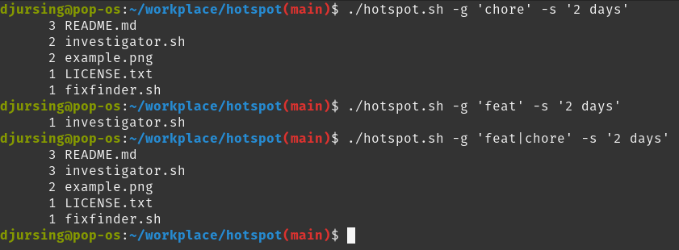

# fixfinder

*Inspired by "Your Code as a Crime Scene" by Adam Tornhill (yet to be read)*

This script helps to identify "hotspots" in your codebase by listing files frequently adjusted in commits related to bug fixes or other issues. These files are often the most complex and error-prone parts of your codebase, and might be good candidates for refactoring or further investigation.

The tool is versatile enough to handle any type of commit description and time frame you might be interested in exploring.

## Getting Started

To get fixfinder up and running on your machine, follow these steps:

### Prerequisites
Make sure you have `git` and `sed` installed on your system, as they are essential for the script to function correctly.

### Installation
1. **Clone the repository:**
```bash
git clone https://github.com/djursing/fixfinder.git
```

2. **Navigate to the repository:**
```bash
cd fixfinder
```

3. **Make the script executable:**
```bash
chmod +x fixfinder.sh
```

### Usage
```
./fixfinder.sh [-g|--grep GREP_STRING] [-s|--since SINCE_DATE]
```

### Options
```
-g, --grep
        Extended Regex pattern to grep in commit messages.
        Follows git log -E --grep definition.
        Default is 'fix|bug'.

-s, --since 
        Time frame for the log search.
        Follows git log --since definition.
        Default is '1 year'.
```

### Examples
